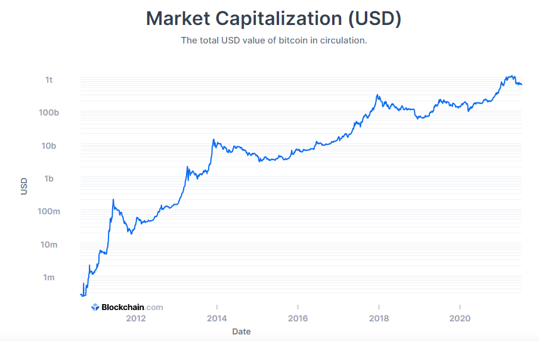

<div align="center">
  <h1>BitcoinMythBusters</h1>
  
</div>

> **Clarification of common misconceptions regarding Bitcoin.**

# What it is

*BitcoinMythBusters* helps you to give **conclusive answers to justified or unfound criticism about Bitcoin**. Click on the answer to copy the text for usage in whatever online forum you like. **No need to waste your time by manually addressing the same concerns over and over again.**

***

# Bitcoin Critiques & Rebuttals

## Bitcoin Has No Intrinsic Value

> ***Bitcoin is entirely digital & not backed by anything and thus has no intrinsic value.***

**Rebuttal**
```
Mankind evaluates every invention based on its utility for a particular purpose. Bitcoin proves its value by continuing to maintain superior monetary characteristics over current forms of currency - backed by advanced cryptography and the most resilient computer network in existence.
```
<details>

  <summary>Detailed rebuttal</summary>

  For supporters, Bitcoin's intrinsic value lies in the fact that it is an **uncorrelated asset**, its intangible properties (**immutable**, **open**, **borderless**, **decentralized**, **censorship-resistant**, etc.), its **scarcity**, and its **utility**.

  For the first time in history, anyone in the world with an internet connection can function as **their very own bank** while participating in the economy with **full control of their wealth**.

  The seven characteristics of money are **durability**, **portability**, **divisibility**, **uniformity**, **limited supply**, and **acceptability**. Many bitcoin proponents adamantly believe that **bitcoin checks all of these boxes** and is therefore hard money with real intrinsic value.

  Oftentimes, those who ascribe zero intrinsic value to bitcoin have done so by way of imperfect knowledge, a narrow perspective, and/or old-aged frameworks that under-represent, if not misrepresent, the capabilities of bitcoin and the very idea of "value".

  Further reading: [Kraken Intelligence - Bitcoin & Intrinsic Value](../_static/Bitcoin-Intrinsic-Value.pdf ':ignore')

</details>

## Bitcoin Is Only Used By Criminals

> ***Bitcoin is used by drug dealers, money launderers and ransomware attackers; therefore it is bad.***

**Rebuttal**
```
Independent reports suggest that the illicit use of Bitcoin is not higher than in the traditional banking system. Like any useful technology Bitcoin can be utilized to do good or harm.
```
<details>

  <summary>Detailed rebuttal</summary>

  It is unlogical to say that Bitcoin is only used for criminal activities while at the same time denying its usability as money for all of us.

  ```mermaid
  graph TD
  A[Is Bitcoin functional?] --> |No| B[Bitcoin is not functional <br/>for criminals nor anyone else]
  A --> |Yes| C[Bitcoin is functional for everyone,<br/>including criminals]

  style B fill:#ff6666
  style C fill:#42B983
  ```

  Studies show that BTC is not excessively used for illegal activities, e.g. former CIA intelligence analyst Micheal Morell concluded in his research that **only about 1%** of all Bitcoin transactions can be **linked to illegal actions**. <sup id="criminals-link-to-footnote1">[1](#criminals-footnote1)</sup>.

  Further reading: [Unchained Capital - Bitcoin is Not for Criminals](https://unchained-capital.com/blog/bitcoin-is-not-for-criminals/)

  <b id="criminals-footnote1">1</b> [Michael Morell et al. - An Analysis of Bitcoin’s Use in Illicit Finance](https://cryptoforinnovation.org/resources/Analysis_of_Bitcoin_in_Illicit_Finance.pdf) [↩](#criminals-link-to-footnote1)

</details>

Possible questions (To be expanded):

## The Government Will Shut Bitcoin Down

> ***Governments will not allow a competing currency which they cannot control.***

**Rebuttal**
```
The decentralized nature of Bitcoin makes it impossible even for governments to eliminate it completely. By trying, companies in these countries could lose the ability to compete in a financial sector completely reshaped by cryptocurrencies.
```
<details>

  <summary>Detailed rebuttal</summary>

  More and more influential individuals and companies <sup id="shut-down-link-to-footnote1">[1](#shut-down-footnote1)</sup> are invested and believe in the cryptocurrency. El Salvador was the first country to declare Bitcoin as legal tender <sup id="shut-down-link-to-footnote2">[2](#shut-down-footnote2)</sup>. This rapidly evolving trend makes it increasingly difficult to prevent the further propagation without provoking counter-reactions.

  Further reading: [Quillette - Can Governments Stop Bitcoin?](https://quillette.com/2021/02/21/can-governments-stop-bitcoin/)

  <b id="shut-down-footnote1">1</b> [CNBC - BlackRock’s Rick Rieder says the world’s largest asset manager has ‘started to dabble’ in bitcoin](https://www.cnbc.com/2021/02/17/blackrock-has-started-to-dabble-in-bitcoin-says-rick-rieder.html) [↩](#shut-down-link-to-footnote1)

  <b id="shut-down-footnote2">2</b> [Reuters - In a world first, El Salvador makes bitcoin legal tender](https://www.cnbc.com/2021/02/17/blackrock-has-started-to-dabble-in-bitcoin-says-rick-rieder.html) [↩](#shut-down-link-to-footnote2)

</details>

## Bitcoin Is Too Volatile

> ***Bitcoin is too volatile in order to be used as currency or store-of-value.***

**Rebuttal**
```
Bitcoin is a young, uncorrelated asset that has risen rapidly in value and will be in the price discovery phase for many years to come. The volatility should decrease as it stores more value due to greater adoption and maturity.
```
<details>

  <summary>Detailed rebuttal</summary>

  At this point in time, as Bitcoin has already achieved a considerable market capitalization but is still several orders of magnitude below a global store of value <sup id="volatile-link-to-footnote1">[1](#volatile-footnote1)</sup>, it makes sense to consider it as an emerging store of value.

  If Bitcoin ever reaches the status of a world reserve currency it can be assumed that the price will develop in tandem with the world economy.

  But even nowadays, when push comes to shove, Bitcoin's "volatility" is barely noticeable when compared to a hyperinflationary currency.

  <b id="volatile-footnote1">1</b> [River Financial - How Much of the World's Money Is in Bitcoin?](https://river.com/learn/how-much-worlds-money-in-bitcoin/) [↩](#volatile-link-to-footnote1)

  Further reading: [Unchained Capital - Bitcoin Is Not Too Volatile](https://unchained-capital.com/blog/bitcoin-is-not-too-volatile/)

</details>

## Bitcoin Wastes Energy

> ***Bitcoin mining uses ever increasing amounts of energy without anything in return.***

**Rebuttal**
```
The consumption of energy is an essential requirement to enforce and maintain Bitcoin's unique characteristics - namely, its immutability, openness, borderlessness, decentralization, resistance to censorship, and scarcity. Bitcoin miners tend to set up their equipment in places where energy costs are particularly low. Renewable energy sources perform remarkably well in this regard.

The big question, however, is another:
How much does mankind value a scarce, completely decentralized and censorship resistant monetary system that is open for everyone - regardless of race, personal wealth, or the degree of government incompetency/malignancy?
```
<details>

  <summary>Detailed rebuttal</summary>

  There is no denying that Bitcoin mining will always stand in competition with other energy users for electricity. Nonetheless there are regions in the world, where unused excess energy is produced, e.g. Iceland (geothermal power), Sichuan/China or Siberia/Russia (both hydroelectric power). Here a global buyer of energy like Bitcoin miners are very welcome.

  The reward halving, which happens every 4 years has an important impact on the energy usage:
  * Scenario 1: The price of Bitcoin continues to appreciate substantially

    The amount of energy needed will rise much slower than the Bitcoin price and finally reach a plateau.
  * Scenario 2: The price of Bitcoin appreciates only slightly

    Less energy is needed to mine Bitcoin due to lower competition in mining.


  Further reading: [Coindesk - The Last Word on Bitcoin’s Energy Consumption](https://www.coindesk.com/the-last-word-on-bitcoins-energy-consumption)

</details>

## Bitcoin Can Be Cloned / Will Be Replaced By A Competitor

> ***Bitcoin is open-source and just one of thousands of cryptocurrencies. Thus, Bitcoin is not scarce and cannot be of any value.***

**Rebuttal**
```
The Bitcoin network has proven to be working flawlessly since its inception in 2009. This and its unique monetary properties are leading to an ever increasing network effect, which makes it very hard for any competitor in the field of value store and medium of exchange to gain traction.
```
<details>

  <summary>Detailed rebuttal</summary>

  Bitcoin can be compared to the protocol on which the internet runs - TCP/IP. It is a rather simple base layer, on which more advanced technologies can be built upon, e.g. HTTP for websites in case of TCP/IP or the Lightning network as a payment layer for Bitcoin. It is extremely unlikely to get worldwide consensus to change the internet protocol, which is used by billions of devices. The same is valid for the Bitcoin protocol.

  All hard forks of Bitcoin (BCH, BSV and others) have not gained any traction and are constantly losing out on all relevant metrics, e.g. hashrate, market cap or node count. 

  Further reading: [Lyn Alden - Analyzing Bitcoin’s Network Effect](https://www.lynalden.com/bitcoins-network-effect/)

</details>

## Bitcoin Is A Bubble

> ***Like the tulip bulbs of 17th-century Holland, Bitcoin is a retail mania, that will vanish.***

**Rebuttal**
```
Normally investment bubbles never come back after they burst. Bitcoin on the other hand had multiple of those cycles - with each bubble being larger than the previous one. This can be interpreted as natural adoption loops with more and more people getting curious and learn about the unique properties of Bitcoin during each bull run.
```
<details>

  <summary>Detailed rebuttal</summary>

  The chances of Bitcoin to vanish is getting smaller with each new individual, company or state holding it. Bitcoin is showing characteristics of growth - both in price and acceptance metrics - similar to an increasingly dominant tech company or protocol.

  
  *Logarithmic display of Bitcoin's increase in market capitalisation from 2012-2021 (Chart Source: Blockchain.com)*

  Further reading: [Satoshi Nakamoto Institute - How We Know Bitcoin Is Not a Bubble](https://nakamotoinstitute.org/mempool/how-we-know-bitcoin-is-not-a-bubble/)

</details>

## Bitcoin Fails As A Currency / Cannot Scale

> ***The volatility, slow transaction time and high fees disqualify Bitcoin for everyday use as a payment method.***

**Rebuttal**
```
The volatility should decrease as Bitcoin stores more value due to greater adoption and maturity. Slow transaction times and the resulting high transaction costs can be solved with the help of layers, which are built on top of the Bitcoin settlement layer. The most popular being the "Lightning Network" at the moment, which enables almost instantanious transactions for negligible fees.
```
<details>

  <summary>Detailed rebuttal</summary>

  It is essential for the security of Bitcoin that **as many people as possible can store and update the Blockchain** - a database with all transactions ever made. In order to achieve that the Blockchain size should only grow modestly, which in turn leads to a limited amount of transactions per second and thus elevated transaction fees in times of high traffic. As of today there is no technical solution to increase transaction throughput without sacrificing decentralization and security.

  ```mermaid
  flowchart LR
    Scalability o--o Decentralization & Security;
    Decentralization o--o Security;
  ```
  *The Blockchain Trilemma: You can only improve 2 at a time*

  The most promising solution to use Bitcoin even for small purchases while maintaining its unique monetary properties is the second-layer-solution ***Bitcoin Lightning***.

  Further watching:

  [](https://www.youtube.com/watch?v=fYv0qvPOX2U&list=PLPQwGV1aLnTurL4wU_y3jOhBi9rrpsYyi&index=11 "Andreas M. Antonopoulos - Why Does Bitcoin Need a Second Layer?")

</details>

## Bitcoin Gets Hacked

> ***There is a lot of news about Bitcoin being hacked and millions of dollars taken. This cannot be a secure system.***

**Rebuttal**
```
Bitcoin has been working flawlessly almost since its inception in 2009. What is getting hacked are crypto exchanges and other centralized entities. It is similar to stating that the US-Dollar is a bad currency because banks get robbed.
```
<details>

  <summary>Detailed rebuttal</summary>

  Bitcoin is by far the most secure network system due to its decentralized nature and the countless specialized computers around the world, which ensure that the system cannot be tampered with.

  To take full advantage of the security one should make sure to self custody his/her coins.

  > "Not your Keys, not your Coins!" - Andreas M. Antonopoulos

  [](https://www.youtube.com/watch?v=vt-zXEsJ61U "Andreas M. Antonopoulos - How Do I Secure My Bitcoin?")

</details>

## Bitcoin Is A Ponzi Scheme

> ***Once people stop pouring new money into Bitcoin it will quickly collapse.***

**Rebuttal**
```
Bitcoin shows no signs of a Ponzi scheme: New investors are not paid with money from old ones, there was no premining of coins and it does not have a leadership team. Bitcoin grew very organically since its creation and the market is pricing the asset, as it sees fit.
```
<details>

  <summary>Detailed rebuttal</summary>

  How is a *Ponzi Scheme* actually defined? And does Bitcoin tick the boxes? See below:

  | Signs of a Ponzi scheme | How is it with Bitcoin?|
  | ------------------------|------------------------|
  | Promised high investment returns | <span style="color:green">Satoshi (the creator) never promised any return</span> |
  | Misleading or outright wrongful statements regarding investment strategy | <span style="color:green">Bitcoin has been open-sourced from the very beginning</span> |
  | "Extroverteted" leadership team | <span style="color:green">Bitcoin's creator is unknown. The rest of the dev community is highly decentralized</span>|
  | Unregistered Investments and Unlicensed Sellers | <span style="color:red">Bitcoin (luckily) doesn't need a license</span>|

  Further reading: [Lyn Alden - Bitcoin: Addressing the Ponzi Scheme Characterization](https://www.lynalden.com/bitcoin-ponzi-scheme/)

</details>

## Bitcoin Can Be Killed By Quantum Computers

> ***Once a powerful enough quantum computer is available Bitcoin is dead.***

**Rebuttal**
```
This is might be a danger once quantum computers with enough processing power are available (possibly 2035-2050) onwards. Work on post-quantum encryption standards is ongoing and would get implemented into the Bitcoin protocol, once the need arises.
```
<details>

  <summary>Detailed rebuttal</summary>

  Without quantum-resistant encyryption standards there are 3 possible attack vectors for quantum computers:
  * **Breaking the hashing algorithm of Bitcoin (SHA-256)**

  At this point in time it is not clear whether quantum computers are able to crack this type of algorithm.

  * **Breaking the public/private key algorithm (ECDSA - Elliptic Curves cryptography)**

  Reused Bitcoin addresses - i.e. addresses which published a signature - are at risk of getting cracked. If SHA-256 can be broken as well then all Bitcoin addresses are vulnerable.

  * **Use quantum computers to mine much more efficiently than with state-of-the-art hardware**

  This would possibly only be a temporary threat until other miners switch to quantum mining as well.

  [](https://www.youtube.com/watch?v=wlzJyp3Qm7s "Andreas M. Antonopoulos - Bitcoin Q&A: Is Quantum Computing a Threat?")

  Further reading: [Forbes - Here’s Why Quantum Computing Will Not Break Cryptocurrencies](https://www.forbes.com/sites/rogerhuang/2020/12/21/heres-why-quantum-computing-will-not-break-cryptocurrencies/)

</details>

## Bitcoin is controlled by China

***

# Contribute

You can add or edit questions and answers by clicking the *Edit on GitHub* button on top of the page. If you add a new Critique & Rebuttal make sure to copy a previous C&R in order to have consistent formatting.